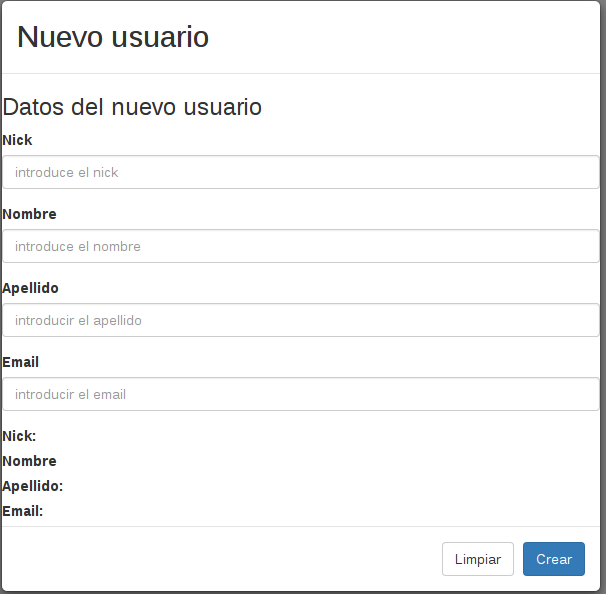

##Cliente Angular.js en myuserlist

###Configuración general

En este capitulo desarrollaremos el cliente de del pequeño servidor que creamos con anterioridad. Dicho cliente estará comprendido por dos componentes de *Angular.js*; un pequeño formulario para crear nuevos usuario y una tabla que nos mostrará la lista de todos ellos. 

Lo primero que haremos será descargar los framework de *Bootstrap* (para hacer las agradable a la vista la web) y *Angular.js* y los introduciremos en la siguiente ruta:

    /site/public/lib
    

*Bootstrap* es simplemente un framework css con una serie aspectos visuales que nos ayudará a hacer nuestra web más estetica de forma muy simple.

Al descargar *Bootstrap* hemos de añadir además de la librería *Javascript* el directorio que contendrá la hoja de estilos.
 
 Esta hoja la será incluida en:
 
    /site/public/styles
 
 
Nuestro controlador de *Angular.js* sera creado bajo el nombre de *controlPanelController.js* en el directorio:

    /site/public/controller
 
 
 Dentro de este fichero incluiremos la declaración del módulo principal de la aplicación:
 
```javascript
    var app = angular.module('app', [])
```

Lo siguiente será crear la vista web que hará las funciones de panel de contol. el fichero .html será creado dentro del siguiente directorio con el nombre de *controlPanel.html*

    /site/public/views/
 
 Lo primero que haremos será crear nuestra cabecera e importar las librerias y nuestro cotrolador, así como vincular nuestro modulo con la web:
 
```html
    <html ng-app="app">
    <head>
       <link rel="stylesheet" href="/styles/bootstrap.min.css" type="text/css">        
      <script src="/lib/jquery-1.11.3.min.js"></script> 
      <script src="/lib/bootstrap.min.js"></script>
      <script src="/lib/angular.min.js"></script>
      <script src="/controllers/controlPanelController.js"></script> 
    </head>
```

###Añadir usuario
La primera funcionalidad que le vamos a añadir al cliente es la de añadir nuevos clientes. Para ello usaremos una directiva que incluirá el controlador con la llamada al método post de nuestro server.

```javascript
    app.directive('createUser', ['$http', function($scope){
    	// Runs during compile
    	return {
    		restrict: 'E',
    		templateUrl: '/views/create-user.html',
    		controller: function($scope, $http){
    
    			$scope.submit = function() {
    	
     				$http.post('http://localhost:3000/api/user', $scope.user).
    				  success(function(data, status, headers, config) {	    
      					alert('usuario creado con exito');
      					$scope.user = {}
      				}).
    				error(function(data, status, headers, config) {
    				    alert(status + 'El usuario no ha podido crearse');
    				});
     			};
    
     			$scope.clear = function(user){
     				$scope.user = {} 	
     			};
    		}
        };
    }]);
```

Después crearemos la vista del componente para crear un nuevo usuario. Lo crearemos bajo el nombre de *create-user.html* en el directorio:

    /site/public/views/
    
El código que incluiremos es el siguiente:

```html
    <selection>
    <button href="#" class="btn btn-lg btn-primary"
       id="filter-btn"
       data-toggle="modal"
       data-target="#basicModal">Nuevo Usuario<span class="badge" id="filterCount"></span></button>
    
       <div class="modal fade" id="basicModal" tabindex="-1" role="dialog"
       aria-labelledby="basicModal" aria-hidden="true">
        <div class="modal-dialog">
            <div class="modal-content">
                <div class="modal-header">
                <h2 class="modal-title" id="myModalLabel">Nuevo usuario</h2>
                </div>	
                <div> 
                	<h3>Datos del nuevo usuario</h3>
                	<form ng-submit="submit()">
                	<div class="form-group">
        				<label>Nick</label>
        				<input type="text" class="form-control" id="exampleInputEmail1"
        				placeholder="introduce el nick"
        				data-ng-model="user.nick" required>
      				</div>
      				<div class="form-group">
        				<label>Nombre</label>
        				<input type="text" class="form-control" id="exampleInputEmail1"
        				placeholder="introduce el nombre"
        				data-ng-model="user.name">
      				</div>
      				<div class="form-group">
        				<label>Apellido</label>
        				<input type="text" class="form-control" id="exampleInputEmail1"
        				placeholder="introducir el apellido"
        				data-ng-model="user.surname" required>
      				</div>
      				<div class="form-group">
        				<label>Email</label>
        				<input type="mail" class="form-control" id="exampleInputEmail1"
        				placeholder="introducir el email"
        				data-ng-model="user.mail">
      				</div>
    		            <div>
    			            <label>Nick: {{user.nick}}</label>
    			            </br>
    			            <label>Nombre {{user.name}}</label>
    			            </br>
    			            <label>Apellido: {{user.surname}}</label>
    			            </br>
    			            <label>Email: {{user.mail}}</label>
    			            </div>
    		            <div class="modal-footer">
    		                <button type="button" class="btn btn-default"
    		                data-ng-click='clear(user)' >Limpiar</button>
    		                <input type="submit" class="btn btn-primary" 
    		                value="Crear"></button>
    		        	</div>
    		        </form>	
        </div>
      </div>
    </div>
    </selection>    
```
En este código generará un botón que al pulsarlo abrirá un dialogo para crear un nuevo usuario dentro de la tabla:



Ahora vincualaremos el componente al panel de control añadiendo la etiqueta que hace referencia a la directiva de crear usuario en nuestro controlador:

```html
    <body>
        <create-user></create-user>
    </body>    
```

Después añadiremos las rutas de los script, las librerías y la web dentro de nuestro fichero de express. El código lo añandiremos entre  las llamadas a las rutas de la api y la ruta para la página de error 404.

```javascript
    app.use(express["static"](__dirname + '/public'));

    //web route
    
    app.get('/',function(req, res){
    	res.sendFile(properties.path + 'site/public/views/controlPanel.html');
    });
    
    
    app.get('/create-user',function(req, res){
    	res.sendFile(properties.path + 'site/public/views/create-user.html');
    });
    
    
    app.get('/lib',function(req, res){
    	res.sendFile(properties.path + 'site/public/lib');
    });
    
    
    app.get('/styles',function(req, res){
    	res.sendFile(properties.path + 'site/public/styles');
    });
    
    
    app.get('/controllers',function(req, res){
    	res.sendFile(properties.path + 'site/public/controllers');
    });
```

Llegado a este punto y antes de continuar con el ejemplo es conveniente testear que se puede acceder correctamente a la web desde el navegador y que se cargan todos los ficheros necesarios en el navegador. Pues es muy común cometer errores en los links a las rutas, y si se debuggea posteriormente puede ser una tarea muy tediosa.


###Añadir listado de usuarios

Descargaremos el proyecto ui-grid desde el respositorio de github en la url:

    https://github.com/angular-ui/ui-grid.info/tree/gh-pages/release
    
Desde donde añadiremos el fichero css y el fichero javascript cada uno a los respectivos directorios de librerias y hojas de estilo de nuestro proyecto. Después añadiremos las rutas en nuestro *ControlPanel.html*

    Ficheros de ui.grid necesarios:
    
    ui-grid-unstable.min.css
    ui-grid-unstable.min.js
    
Una vez localizados los añadiremos:


     <link rel="stylesheet" href="http://ui-grid.info/release/ui-grid-unstable.css"
     type="text/css">
     
     <script src="http://ui-grid.info/release/ui-grid-unstable.js"></script>
     
Para termiar, dentro de body añadiremos la referencia a la tabla que más tarde definiremos en el controlador:

    <div id="userGrid" ui-grid="gridOptions" class="grid"></div>
    
Dentro de *controlPanelController.js* injectaremos las dependicias de las librerías dentro de la declaración del módulo:

    var app = angular.module('app', ['ngAnimate', 'ngTouch','ui.grid']);

Como se puede ver hemos añadido a la aplicación las dependecnias 'ngAnimate', 'ngTouch', y 'ui.grid'

Después añadimos el controlador que realizará la petición al servidor.

```javascript
app.controller('MainCtrl', ['$scope', '$http', function($scope, $http, uiGridConstants){
    
    
app.controller('MainCtrl', ['$scope', '$http', function($scope, $http, uiGridConstants){

    $http.get('http://localhost:3000/api/allUsers')
        .success(function(data){
 	    $scope.userData = data;
 	    });  
    }]);

```

Y con este último añadido ya tendríamos la lista de todos los usuarios y la posibilidad de crearlos dentro de nuesta app de ejemplo.


    


