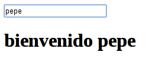

##Primeros pasos con Angular.js

Lo primero que hemos deshacer es descarganos la versión .min(sin espacios para ahorrar bytes de transferencia) y ponerla a disposición del código web dentro de nuestro servidor.

```html
    <!--ejemplo de import de angular.js en nuestro html -->
    
    <script type="text/javascript" src="angular.min.js"></script>
```

Ángular.js requiere de jquery para poder funcionar por lo tanto hemos de descargarlo y enlazarlo en la web de la misma forma que se ha hecho en el código anterior.

de esta forma ya podríamos hacer uso de las funcionalidades de Angular.js. que como en todo framework web consiste en realizar una serie de operaciones y en caso de querer interactuar con el usuario se genera código html dinánico que se incrusta en la web que se está mostrando. 

Para situar el lugar donde queremos que Ángular.js genere el código se usa *"" {{ valores }}*, el "juego" de las dos llaves es muy característico de  *handlebars*.

Creemos una web con ángular muy simple:

```html
    <!DOCTYPE html>
    <html ng-app>
    <body>
        <h1>suma {{ 1 + 1 }}</h1>
        
    <script
    <!-- nuestra ruta de ángular -->
    </script>
    </body>
    </html>
```

Lo que este ejemplo nos mostrará por pantalla es *suma 2* como elemento de título.
Podemos observar dos elementos que no son caracteristicos de html: *ng-app* que es la directiva principal y la que enjaula todo el código consencutivo bajo Ángular, y {{ 1 +  1 }} que sigue la nomenclatura de ángular para designar elementos que generaran resultados dinámicos.


muestro un ejemplo simple pero interactivo:

```html
    <!DOCTYPE html>
    <html>
    <body ng-app>
        <input type="text" ng-model="name" placeholder="Introduzca su nombre"
        <h1>bienvenido <span ng-bind="name"></span></h1>
        
    <script
    <!-- nuestra ruta de ángular -->
    </script>
    </body>
    </html>
```

En el anterior ejemplo podremos observar como el saludo cambia en tiempo real respecto al nombre que escribamos en el input:



Tras estas dos breves aplicaciones se mostrará la sintaxis de *Angular.js*.


